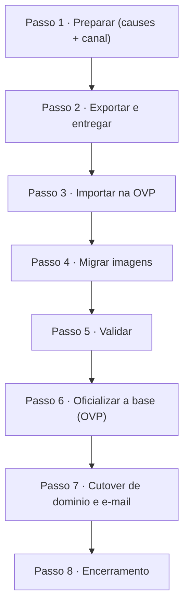

# Integração Técnica — Voluntária+ → OVP (Rede Atados)

> **Guia passo a passo** para transferir o **catálogo de ONGs** do Voluntária+ para a plataforma
> **OVP** da Rede Atados, que passa a deter **todo o controle** do catálogo.
> Versão 3.0 · Para a equipe técnica da Rede Atados

**Escopo:** somente o **catálogo de ONGs** (`ongs` + contato do dono + logos).
**Fora:** voluntários, interações, doação de sangue, senhas.
**Resultado:** a **base da OVP** vira a fonte oficial e `voluntariamais.com.br` aponta para a Atados.

**Legenda:** 🟡 Voluntária+ · 🔵 Atados · ✅ os dois · 🔒 segredo (canal seguro) · ⭐ ponto crítico

---

## Decisões já adotadas

Para o processo não travar em reuniões, **já tomamos as decisões abaixo** (padrão recomendado).
Não precisam ser rediscutidas — só mude se houver um motivo forte.

| Tema | Decisão adotada |
|---|---|
| **Quais ONGs** | Só as **aprovadas** (`admin_approved = true`). As não aprovadas não migram. |
| **Controle** | A **OVP** vira a fonte da verdade; o catálogo passa a ser **gerido inteiramente pela Atados**. |
| **Sentido da transferência** | **Mão única:** a Atados **recebe** os dados do Voluntária+. O Voluntária+ **não** mantém acesso à OVP. |
| **Acesso aos dados** | Entregamos os **arquivos exportados** por canal seguro (ou, se preferirem, um acesso **read-only temporário** à nossa base). Esse acesso é **revogado** ao final. |
| **CNPJ** | Migrar **sem CNPJ** (`document` vazio) — não bloqueia. Coletado depois, no perfil da ONG. |
| **Categorias → `causes`** | Usar o **de-para já proposto** (`de-para-causas.csv`); a Atados só **confirma os IDs**. |
| **Endereço** | Enviar `endereco_fisico` + `lat`/`lng` atuais; **geocodificar o que faltar** com a chave Google que já temos. |
| **Dono (`owner`)** | **1 usuário OVP por ONG** a partir do e-mail do dono; senha via **"definir senha"** no 1º acesso. |
| **Campos sem par** | `how_to_help`, `doações`, `necessidades` e `horários` entram **concatenados em `details`**. |
| **`type` / capa** | `type = 0` (organização padrão); sem `cover`. |
| **Imagens** | **Re-upload** das logos a partir das URLs públicas do bucket `ongs`. |
| **Domínio** | **Manter o registro conosco** e **delegar o DNS** à Cloudflare da Atados (reversível). |
| **Supabase** | **Read-only por 90 dias** como backup; depois descomissiona. |

> Antes de começar, a Atados só precisa **confirmar os IDs de `causes`** (Passo 1). A transferência
> é **de mão única**: a Atados recebe os dados, importa na OVP e assume o controle — o Voluntária+
> não opera nada na OVP depois disso.

---

## Roteiro



---

## Passo 1 · Preparar (causes + canal)

> 🔵 **Atados** · 🔒 canal seguro · ✅ **Pronto quando:** IDs de causes preenchidos e canal de entrega combinado.

A única preparação antes de exportar:

- 🔵 Abrir `de-para-causas.csv` (já vem com a **causa sugerida** para cada categoria) e preencher só o **ID** de cada causa na OVP.
- 🟡🔵 Combinar o **canal seguro** para a entrega dos dados (gerenciador de senhas / link protegido).

---

## Passo 2 · Exportar e entregar

> 🟡 **Voluntária+** · ⏱️ ~10 min · ✅ **Pronto quando:** arquivos entregues à Atados pelo canal seguro.

```bash
# .env.local com NEXT_PUBLIC_SUPABASE_URL e SUPABASE_SERVICE_ROLE_KEY (uso local)
node docs/integracao-atados/export-ongs.mjs --dry-run   # confere o plano
node docs/integracao-atados/export-ongs.mjs             # exporta as ONGs aprovadas
```

Gera `ongs.json`, `ongs.csv`, `ovp-preview.json` (já no formato da OVP, com as decisões aplicadas) e `resumo.json`. **Entregar a pasta `export/` à Atados** pelo canal combinado.

> *Alternativa:* em vez de entregar arquivos, conceder à Atados um **acesso read-only temporário** à base para ela mesma extrair. Em qualquer caso, o acesso é **de mão única e temporário** (revogado no Passo 8).

---

## Passo 3 · Importar na OVP

> 🔵 **Atados** · ✅ **Pronto quando:** nº de `Organizations` = nº de ONGs entregues.

A Atados importa na **própria OVP**, com as **credenciais dela** (`OVP_API_URL`/`OVP_API_TOKEN` ficam só do lado da Atados). O de-para já vem aplicado no `ovp-preview.json` (resumo no Anexo A).

1. Preencher `CAUSES_MAP` (do Passo 1) e as credenciais da OVP no template.
2. Rodar:
   ```bash
   node docs/integracao-atados/importar-ovp.template.mjs            # dry-run (não envia)
   node docs/integracao-atados/importar-ovp.template.mjs --commit   # envia
   ```
3. Guardar o mapa **`id Voluntária+ ↔ id OVP`** para reconciliação.

---

## Passo 4 · Migrar as imagens (logos)

> 🔵 **Atados** · ✅ **Pronto quando:** cada ONG com logo tem `image` vinculada na OVP.

Para cada ONG, baixar a logo de `thumbnail_url` (URLs **públicas** do bucket `ongs`), subir no endpoint de upload da OVP e vincular ao campo `image`.

---

## Passo 5 · Validar e reconciliar

> ✅ **Os dois times** · **Pronto quando:** contagens e amostragem batem.

- **Contagem:** Organizations criadas = total do `resumo.json`.
- **Amostra:** revisar 10–20 ONGs (nome, descrição, contato, categorias, logo, `published`).
- **Obrigatórios da OVP:** todas têm `name`, `owner` e `type` válidos.

---

## Passo 6 · Oficializar a base (OVP vira a fonte da verdade)

> ⭐ 🟡🔵 **Ponto crítico** · ✅ **Pronto quando:** OVP é oficial e Supabase está em read-only.

A partir daqui, **o catálogo vive oficialmente na base da OVP** — nunca duas bases concorrentes.

- 🟡 Congelar a escrita no Supabase (**read-only**) — nenhuma edição nova entra ali.
- 🔵 OVP assume como base oficial e única.
- 🟡 Manter o Supabase como **backup por 90 dias** e então **descomissionar**.

---

## Passo 7 · Cutover de domínio e e-mail

> 🟡🔵 **Os dois times** · ↩️ rollback = reverter DNS · ✅ **Pronto quando:** `voluntariamais.com.br` abre o site da Atados e o e-mail autentica.

Executar **somente após** o Passo 5–6. **Decisão:** mantemos o registro do domínio e **delegamos o DNS** (não transferimos o registro).

1. 🟡 Reduzir o **TTL de DNS** (ex.: 300s) 24–48h antes.
2. 🟡 Apontar os nameservers de `voluntariamais.com.br` para a **Cloudflare da Atados**.
3. 🔵 Configurar o DNS de `voluntariamais.com.br` e `www` para o frontend (Vercel/Cloudflare) e validar **SSL**.
4. 🔵 Configurar e-mail no **Sparkpost** (SPF/DKIM/DMARC) e enviar teste — hoje o remetente é `info@voluntariamais.com.br` via Resend.

---

## Passo 8 · Encerramento

> 🔵🟡 **Os dois times** · ✅ **Pronto quando:** catálogo 100% sob controle da Atados e acessos temporários revogados.

- 🔵 O catálogo passa a ser **gerido inteiramente na OVP** pela Atados.
- 🟡 **Revogar** o acesso temporário concedido (se houve) e quaisquer credenciais de transição.
- 🟡 Descomissionar o Supabase após os 90 dias de backup.

> O Voluntária+ **não** mantém conta nem token na OVP — encerrada a transferência, a operação é toda da Atados.

---

## Anexo A · De-para resumido (`ongs` → OVP `Organization`)

Versão completa: `de-para-ongs-ovp.csv`. As decisões já estão refletidas aqui.

| Origem (Voluntária+) | Destino OVP | Regra (decidida) |
|---|---|---|
| `nome` | `name` | cópia |
| `short_description` / `descricao` | `description` / `details` | truncar 160 / 3000 |
| `how_to_help`, `doações`, `necessidades`, `horários` | `details` | concatenados com rótulos |
| `whatsapp` / dono `telefone` | `contact_phone` | normalizar +55 |
| dono `nome` / `email` | `contact_name` / `contact_email` + `owner` | criar User pelo e-mail |
| `endereco_fisico` + `lat`/`lng` | `address` | texto + coords; geocodificar o que faltar |
| `tipo[]` + `additional_categories[]` | `causes` | de-para proposto; Atados confirma IDs |
| `thumbnail_url` | `image` | re-upload (Passo 4) |
| `admin_approved` | `published` | só aprovadas → publicadas |
| — | `document` (CNPJ) | vazio agora; coletar depois |
| — | `type` | `0` (padrão) |

## Anexo B · Arquivos e variáveis

| Arquivo | Para quê |
|---|---|
| `de-para-ongs-ovp.csv` | mapeamento de campos (decidido) |
| `de-para-causas.csv` | categorias → causes (sugestão pronta; Atados confirma IDs) |
| `export-ongs.mjs` | 🟡 exporta o catálogo já no formato da OVP (Passo 2) — usa `SUPABASE_SERVICE_ROLE_KEY` (lado Voluntária+) |
| `importar-ovp.template.mjs` | 🔵 importa na OVP (Passo 3) — usa `OVP_API_URL`/`OVP_API_TOKEN` (lado Atados) |
| `build-pdf.mjs` | gera este PDF |
| `.env.example` | modelo de variáveis (nenhum segredo real) |

> 🔒 **Segurança:** segredos só por canal seguro (gerenciador de senhas); nunca no git, e-mail ou PDF. O acesso da Atados aos nossos dados é **temporário** e revogado no Passo 8. **LGPD:** o catálogo é majoritariamente dado de PJ/contato público; a base legal cobre o compartilhamento dos dados de contato do dono com a Atados (operadora).

---

*Voluntária+ × Rede Atados · Origem: repo `inovatecteam/vmaisv2`, Supabase `jrovakzvlhvbzyftphxl`, site `voluntariamais.com.br`.*
